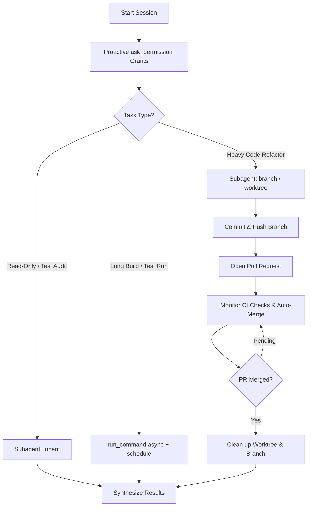

# Agentic Autonomy & Subagent Orchestration Skill

This skill governs autonomous agent execution, subagent orchestration, proactive permission management, and background task execution in Antigravity.

---

## 1. PROACTIVE PERMISSION ELEVATION

To eliminate repetitive manual approval prompts for safe local operations, agents MUST proactively request broad command prefix grants using `ask_permission` at the start of a session or task.

### Top-Level CLI Command Prefixes
When executing terminal commands, request permissions by **command prefix** (e.g. `Action: command`, `Target: "uv"`), which auto-authorizes all subcommands:
- `uv` (authorizes `uv run pytest`, `uv run ruff`, `uv run mypy`, `uv sync`, etc.)
- `git` (authorizes `git status`, `git diff`, `git log`, `git checkout`, `git commit`, etc.)
- `docker` (authorizes `docker compose`, `docker ps`, etc.)
- `pyadr` (authorizes `pyadr init`, `pyadr new`, `pyadr check-adr-repo`, etc.)
- `pre-commit` (authorizes `pre-commit run --all-files`, etc.)
- `pytest` (authorizes standalone `pytest` runs)

---

## 2. RISK-ADAPTIVE SUBAGENT DELEGATION

AI agents MUST delegate independent, heavy, or parallelizable subtasks to dedicated subagents using `invoke_subagent` or `define_subagent`.

### Subagent Workspace Selection Policy
Selection of workspace mode for subagents MUST depend on task risk and scope:

| Task Risk & Type | Recommended Workspace Mode | Description |
| :--- | :--- | :--- |
| **Low-Risk / Read-Only** | `Workspace: inherit` | Read-only research, file grep searches, running test suites, linting/typing audits, doc verification. Shares the parent workspace for high performance. |
| **High-Risk / Refactoring** | `Workspace: branch` | Structural code refactoring, experimental feature development, multi-file code mutations. Creates an isolated git workspace branch to isolate changes. |

### Specialized Subagent Definitions (`define_subagent`)
Agents should define specialized roles when embarking on complex tasks:
1. **`Codebase Researcher`**: Dedicated to running `git-tree-context-search`, grepping logs, and synthesizing architecture.
2. **`Quality & Test Runner`**: Runs `pytest`, `ruff`, `mypy`, and `bandit` in parallel while the main agent plans or writes specs.
3. **`Spec Executor`**: Dedicated to implementing approved feature specs in an isolated branch.

---

## 3. NON-BLOCKING BACKGROUND EXECUTION & TIMERS

- **Async Command Execution**: For long-running operations (such as test suites, container startup, or builds), launch commands using `run_command` with non-blocking settings (`WaitMsBeforeAsync: 500`).
- **Notification-Driven Wakeup**: Use `schedule` timers (`TimerCondition: "task-id"` or `"any"`) to check on running tasks without polling in loops.
- **Slash Commands Recommendations**:
  - `/goal`: Recommend to the user for overnight or extended autonomous task completion.
  - `/schedule`: Recommend for recurring crons or timed reminders.
  - `/teamwork-preview`: Recommend when a large multi-agent swarm is required.

---

## 4. WORKFLOW & WORKTREE LIFECYCLE SUMMARY

