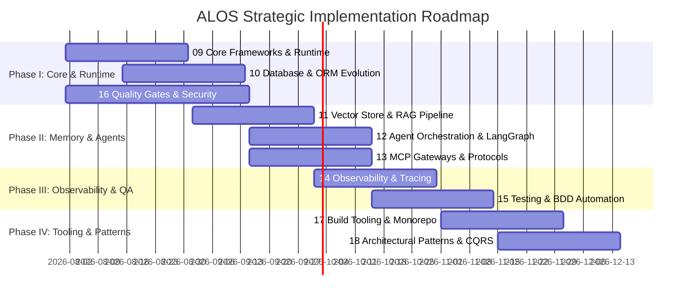

# ALOS Architectural Roadmap & Capability Expansion

## Executive Overview
This roadmap establishes a multi-phase engineering plan to eliminate custom reimplementations, modernize the ALOS software architecture, and achieve enterprise-grade stability, observability, and agentic autonomy.

All 100 architectural enhancement ideas are codified into **10 canonical SpecKit modules** (`specs/09-` through `specs/18-`). Each module provides detailed specifications (`spec.md`), technical execution plans (`plan.md`), task checklists (`tasks.md`), and quality gate requirements (`checklists/requirements.md`).

---

## Strategic Phases & Spec Mapping

---

## Specification Directory Index

| Spec Module | Domain Area | Target Technologies & Core Patterns | Spec Directory |
| :--- | :--- | :--- | :--- |
| **Spec 09** | Core Frameworks & Runtime | `pydantic-settings`, `tenacity`, `structlog`, `rich`, `diskcache`, `cachetools`, `humanize`, `dependency-injector`, `typer` | [`specs/09-core-frameworks-and-runtime/`](file:///c:/Users/bfoxt/n8nSetup/specs/09-core-frameworks-and-runtime/) |
| **Spec 10** | Database & ORM Evolution | SQLAlchemy 2.0 `Mapped[T]`, `alembic autogen`, `pgvector`, `asyncpg` pooling, `duckdb`, `polars` | [`specs/10-database-and-orm-evolution/`](file:///c:/Users/bfoxt/n8nSetup/specs/10-database-and-orm-evolution/) |
| **Spec 11** | Vector Store & RAG Pipeline | `lancedb`, `chromadb`, `sentence-transformers`, `rapidfuzz`, `tiktoken`, hybrid BM25+dense RRF | [`specs/11-vector-store-and-rag-pipeline/`](file:///c:/Users/bfoxt/n8nSetup/specs/11-vector-store-and-rag-pipeline/) |
| **Spec 12** | Agent Orchestration & State | `langgraph` state machines, `instructor` structured outputs, `temporalio`, `transitions` FSM | [`specs/12-agent-orchestration-and-state-graphs/`](file:///c:/Users/bfoxt/n8nSetup/specs/12-agent-orchestration-and-state-graphs/) |
| **Spec 13** | MCP Gateways & Protocols | Official Anthropic `mcp` SDK, `fastmcp`, `httpx` async, `pybreaker` circuit breakers, Authlib OAuth2 | [`specs/13-mcp-gateways-and-protocols/`](file:///c:/Users/bfoxt/n8nSetup/specs/13-mcp-gateways-and-protocols/) |
| **Spec 14** | Observability & Tracing | OpenTelemetry SDK, `prometheus_client`, `loguru`, `sentry-sdk`, DB audit triggers | [`specs/14-observability-metrics-and-tracing/`](file:///c:/Users/bfoxt/n8nSetup/specs/14-observability-metrics-and-tracing/) |
| **Spec 15** | Testing & BDD Automation | `pytest-bdd` Gherkin, `hypothesis` property testing, `time-machine`, `vcrpy`, `factory_boy` | [`specs/15-testing-bdd-and-qa-automation/`](file:///c:/Users/bfoxt/n8nSetup/specs/15-testing-bdd-and-qa-automation/) |
| **Spec 16** | Quality Gates & Security | Ruff (`UP`, `B`, `SIM`), Mypy strict mode, `pre-commit` hooks, SonarQube, `bandit` AST scans | [`specs/16-quality-gates-linting-and-security/`](file:///c:/Users/bfoxt/n8nSetup/specs/16-quality-gates-linting-and-security/) |
| **Spec 17** | Build Tooling & Monorepo | `uv` package manager, `pyproject.toml` workspaces, `pyadr` CLI, multi-stage Docker | [`specs/17-build-tooling-and-monorepo-workflow/`](file:///c:/Users/bfoxt/n8nSetup/specs/17-build-tooling-and-monorepo-workflow/) |
| **Spec 18** | Architectural Patterns | CQRS, Event Bus, Repository Pattern, Strategy Pattern, Saga Pattern, Null Object Pattern | [`specs/18-architectural-patterns-and-cqrs/`](file:///c:/Users/bfoxt/n8nSetup/specs/18-architectural-patterns-and-cqrs/) |

---

## Quality & Acceptance Gates

All roadmap implementations must satisfy the following strict quality criteria before merging into `main`:
1. **SpecKit Completeness**: Each feature must contain matching `spec.md`, `plan.md`, `tasks.md`, and `checklists/requirements.md`.
2. **ADR Record Verification**: Major architectural transitions must be recorded using `uv run pyadr propose` and `accept`.
3. **100% Test Passing Rate**: Full unit and integration suites must pass via `.\.venv\Scripts\pytest.exe`.
4. **Zero Linting & Typing Errors**: Code must pass `uv run ruff check alos` and `uv run mypy alos`.
5. **Signed Git Isolation**: All commits must be signed (`git commit -S`) with isolated explicit file staging.
