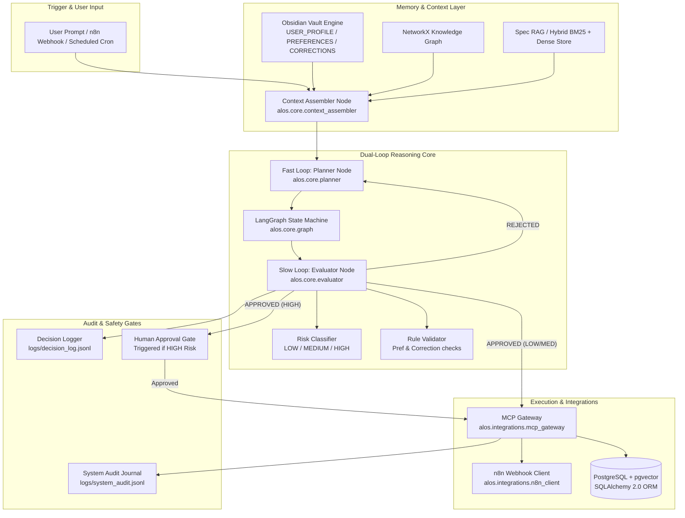
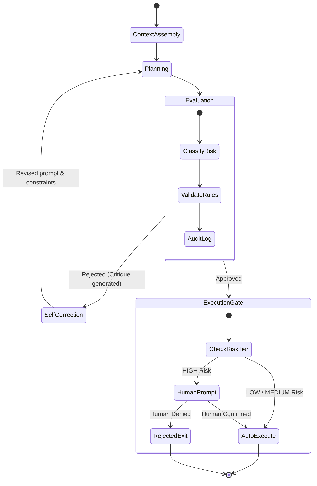

# ALOS Technical Architecture & Component Deep Dive

> This document provides a comprehensive technical breakdown of the **Local Autonomous Life Operating System (ALOS)** architecture, explaining how its dual-loop reasoning core, safety gates, memory engines, state machines, database models, and integrations work together.

---

## 1. High-Level Architecture Blueprint

ALOS is built on a decoupled, modular architecture adhering to **SOLID design principles**, strict Pydantic v2 schemas, and local-first execution.



---

## 2. Core Engine Components

### A. Context Assembler (`alos.core.context_assembler`)
The `ContextAssembler` is responsible for aggregating all contextual knowledge prior to plan generation:
- Parses active Markdown notes from `vault/` (`USER_PROFILE.md`, `PREFERENCES.md`, `CORRECTION_LEDGER.md`).
- Executes hybrid vector + BM25 keyword searches across `specs/` using `SpecRAGSystem`.
- Compiles the retrieved information into a strictly typed `ContextPayload` dataclass passed directly into the Planner.

### B. Dual-Loop Reasoning Engine
The core reasoning workflow split into two distinct loops:

```
+------------------------------------------------------------------------------------+
|                               DUAL-LOOP REASONING ENGINE                           |
|                                                                                    |
|  FAST LOOP: PLANNER                             SLOW LOOP: EVALUATOR               |
|  - Ingests ContextPayload                       - Classifies action risk           |
|  - Generates candidate BaseActions               - Validates against preferences    |
|  - Formulates execution steps                   - Emits Decision Log ADR           |
|  - Performs self-correction on rejection        - Gates HIGH risk operations       |
+------------------------------------------------------------------------------------+
```

#### 1. Fast Loop — Planner Node (`alos.core.planner`)
- Generates candidate plans consisting of strongly-typed Pydantic action models (`GoogleCalendarEvent`, `EmailDraft`, `TodoistTask`, `WebSearch`).
- Receives feedback critiques from the Evaluator Node when a proposed plan fails validation, triggering up to $N$ automated self-correction rounds.

#### 2. Slow Loop — Evaluator Node (`alos.core.evaluator`)
- **`RiskClassifier`**: Implements fail-safe risk classification per Constitution Article V:
  - **LOW**: Read-only operations (`web_search`, local note search).
  - **MEDIUM**: Schema-validated drafts (`todoist_create_task`, `google_calendar_create_event`, `vault_update_note`).
  - **HIGH**: External mutations (`email_send`, `calendar_delete`, `financial_transaction`, `email_create_draft`).
  - *Fail-Safe Default*: Unrecognized actions automatically default to **HIGH Risk**.
- **`RuleValidator`**: Audits proposed actions against:
  - `validate_calendar_preferences()` (e.g., verifying meeting start times against preferred working hours).
  - `validate_corrections_ledger()` (e.g., checking past user corrections to prevent recurring errors).
- **`DecisionLogger` Protocol**: Every single evaluation pass—whether approved or rejected—emits a structured Decision Log ADR record to `logs/decision_log.jsonl` recording trigger context, rationale, constitution articles checked, and self-correction round count.

---

## 3. LangGraph Orchestration State Machine (`alos.core.graph`)

ALOS uses **LangGraph** to model the execution flow as a deterministic state machine:



### State Graph Nodes:
1. `context_assembly_step`: Builds `ContextPayload` from vault and RAG stores.
2. `planner_step`: Calls LLM/planner to generate candidate `BaseAction` models.
3. `evaluator_step`: Evaluates actions, classifies risk, and checks rules.
4. `self_correct_step`: If `EvaluationResult.valid == False`, increments `self_correction_rounds` and feeds critique back to `planner_step`.
5. `execute_step`: Dispatches approved actions to MCP Gateway / DB.

---

## 4. Memory & Knowledge Base Architecture

ALOS memory is multi-layered, combining plain Markdown files, graph networks, and vector stores:

```
+------------------------------------------------------------------------------------+
|                                 ALOS MEMORY ENGINE                                 |
|                                                                                    |
|  1. OBSIDIAN VAULT             2. KNOWLEDGE GRAPH            3. SPEC RAG           |
|  Markdown frontmatter          NetworkX graph engine        Rank-BM25 + Dense      |
|  USER_PROFILE.md               Relationships & tags          spec.md vector index  |
|  PREFERENCES.md                entity connections            semantic specs lookup |
|  CORRECTION_LEDGER.md                                                              |
+------------------------------------------------------------------------------------+
```

### A. Obsidian Vault Manager (`alos.memory.obsidian_vault`)
- Reads and updates human-readable Markdown notes in `vault/`.
- Extracts structured YAML frontmatter and key sections (`## Preferences`, `## Corrections`).
- Synchronizes with Obsidian in real-time.

### B. Obsidian Knowledge Graph (`alos.memory.obsidian_graph`)
- Built using `networkx.DiGraph`.
- Maps links, tags (`#preference`, `#correction`, `#contact`), and entity nodes across vault files for multi-hop graph traversal.

### C. Spec RAG System (`alos.memory.spec_rag`)
- Implements hybrid Reciprocal Rank Fusion (RRF) combining:
  - **Keyword Search**: `rank-bm25` BM25Okapi over code and spec markdown documents.
  - **Dense Embeddings**: `SentenceTransformer` local embeddings stored in `VectorStore`.

---

## 5. Persistence & Database ORM Layer (`alos.db`)

ALOS leverages **SQLAlchemy 2.0 ORM** with `asyncpg` for PostgreSQL storage:

```
+------------------------------------------------------------------------------------+
|                             SQLAlchemy 2.0 ORM SCHEMAS                             |
|                                                                                    |
|  +------------------+     +-------------------+     +--------------------+         |
|  |   UserSession    |     |   ActionRecord    |     |   DecisionRecord   |         |
|  |------------------|     |-------------------|     |--------------------|         |
|  | id: UUID         |1   *| id: UUID          |1   *| id: UUID           |         |
|  | user_id: String  |---->| session_id: UUID  |---->| action_id: UUID    |         |
|  | status: String   |     | action_type: Str  |     | decision: String   |         |
|  | created_at: TS   |     | payload: JSONB    |     | risk_level: String |         |
|  +------------------+     +-------------------+     +--------------------+         |
+------------------------------------------------------------------------------------+
```

- **`UserSession`**: Tracks user sessions, state, and conversation turns.
- **`ActionRecord`**: Stores proposed and executed actions as structured JSONB payloads.
- **`DecisionRecord`**: Maps 1-to-1 with Decision Log ADR entries for SQL querying and analytics.
- **`AuditTrail`**: Append-only execution history for compliance and troubleshooting.
- **Alembic Migrations**: All schema modifications are versioned in `alembic/versions/`.

---

## 6. MCP Gateways & Integrations (`alos.integrations`)

ALOS integrates with external services using Anthropic's **Model Context Protocol (MCP)**:

- **`MCPGateway`**: Standardized gateway for calling external tools (Google Calendar, Todoist, Email).
- **Circuit Breakers (`pybreaker`)**: Prevents cascading failures when external services are unreachable.
- **`N8nClient`**: Interoperability layer for sending webhooks to local `n8n` automation containers and inspecting execution results.

---

## 7. Audit & Decision Provenance

In accordance with Constitution Article III, ALOS guarantees 100% auditability:

1. **`logs/decision_log.jsonl`**: Append-only JSON Lines file capturing every Evaluator decision.
2. **`logs/system_audit.jsonl`**: Complete trace of state transitions, tool calls, and error stack traces.
3. **Database Audit Records**: Mirror of audit journals stored in PostgreSQL `audit_trail` table.
