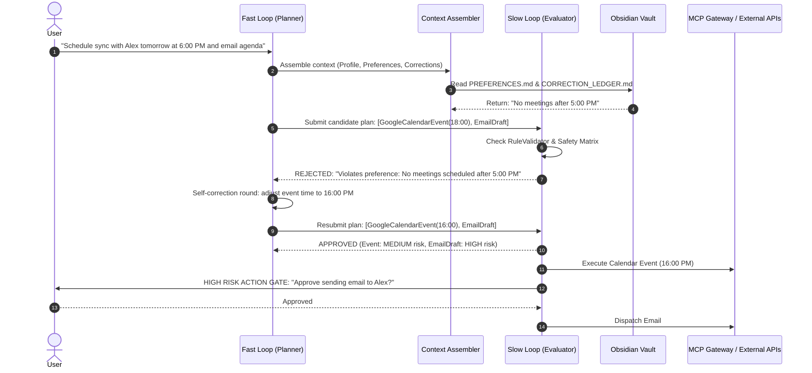

# The Core Idea & Philosophy of ALOS

> **ALOS (Local Autonomous Life Operating System)** is a local-first, privacy-focused AI agent system designed to manage daily life workflows, integrations, and decision-making without giving up control or data sovereignty to cloud third parties.

---

## 1. Why ALOS Exists

In the era of cloud-hosted AI agents, users are asked to make a dangerous trade-off: **convenience in exchange for total data surrender**. To automate your calendar, manage your tasks, draft your emails, or organize your notes, cloud services require continuous access to your private emails, financial tokens, work logs, and personal thought journals.

Furthermore, cloud AI systems operate as **opaque single-pass inference engines**. When you ask a cloud model to perform an action, it executes it immediately in a single pass—without auditing your personal preferences, checking historical corrections, or giving you a deterministic safety gate before external API mutations occur.

**ALOS changes the paradigm:**

1. **Local-First Data Sovereignty**: All reasoning, vector embeddings, personal profiling, and knowledge search run strictly on your local machine using local storage and local models.
2. **Dual-Loop Reason-Before-Act Architecture**: ALOS never mutates state on a single pass. It generates candidate plans in a **Fast Loop** and subjects every proposed action to a rigorous **Slow Loop Evaluator** before execution.
3. **Deterministic Safety Matrix**: Low-risk actions (local queries) run autonomously. High-risk actions (sending emails, deleting calendar events, financial calls) **strictly require explicit human consent**.
4. **Living Markdown Vault Memory**: Instead of a black-box vector database, ALOS reads and writes to your human-readable **Obsidian Vault** (`vault/USER_PROFILE.md`, `vault/PREFERENCES.md`, `vault/CORRECTION_LEDGER.md`), making system memory 100% transparent and editable.

---

## 2. The Core Philosophy: Reason, Evaluate, Gate, Log

ALOS operates under four fundamental operational principles:

```
+-----------------------------------------------------------------------------------+
|                                 ALOS PHILOSOPHY                                   |
|                                                                                   |
|  1. LOCAL PRIVACY      2. DUAL-LOOP REASONING     3. SAFETY MATRIX    4. AUDIT    |
|  Local embeddings,     Planner proposes,           Low / Med / High   Append-only |
|  Obsidian vault,       Evaluator checks           Risk gates with    decision    |
|  zero cloud leakage    against Constitution       human consent      provenance  |
+-----------------------------------------------------------------------------------+
```

### Principle A: Dual-Loop Reasoning Engine
When a prompt or trigger enters ALOS, it is processed by two complementary loops:
- **Fast Loop (Planner)**: Assembles user context, queries local RAG/vault memory, and constructs a candidate execution plan containing structured `BaseAction` objects (e.g., `GoogleCalendarEvent`, `EmailDraft`, `TodoistTask`).
- **Slow Loop (Evaluator & Critic)**: Evaluates each action against your `.specify/memory/constitution.md`, personal preferences, and historical correction ledger. If an action violates a rule, it is **rejected** with actionable critique, forcing self-correction before any execution occurs.

### Principle B: Safety Matrix & Risk Classification
Not all actions are equal. ALOS categorizes every proposed operation into a strict, fail-safe Risk Level:

| Risk Level | Action Types | Autonomous Execution | Approval Requirement |
| :--- | :--- | :--- | :--- |
| **LOW** | Web searches, local file reads, vault queries | ✅ Fully Autonomous | Zero human prompts |
| **MEDIUM** | Creating task drafts, drafting calendar events, updating notes | ✅ Schema-Validated | Logged; auto-executed if schema & rules pass |
| **HIGH** | Sending emails, deleting calendar events, financial transactions | ❌ Gated | **Requires explicit human consent** before dispatch |

> [!IMPORTANT]
> **Fail-Safe Principle**: If an action type is unknown or unclassified, ALOS automatically classifies it as **HIGH Risk**, preventing accidental unauthorized mutations.

### Principle C: Living Markdown Vault as Memory Engine
Your preferences and historical corrections should not be hidden inside closed-source proprietary databases. ALOS stores memory in plain Markdown files in your local `vault/`:

- `vault/USER_PROFILE.md`: Contains your background, core roles, contacts, and identity.
- `vault/PREFERENCES.md`: Formats your explicit rules (e.g., *"No meetings after 5:00 PM"*, *"Default to 25-minute focus blocks"*).
- `vault/CORRECTION_LEDGER.md`: Records past mistakes and corrections (e.g., *"Always check Delta flights when user searches for travel"*).

Because these files are plain Markdown, you can open them in **Obsidian** or VS Code at any time, edit them by hand, or let ALOS update them automatically when you provide feedback.

---

## 3. Real-World Scenario: How ALOS Handles a Request

To understand ALOS in practice, consider what happens when you ask:

> *"Schedule a strategy sync with Alex tomorrow at 6:00 PM and email him the agenda."*



1. **Context Synthesis**: ALOS loads `vault/PREFERENCES.md` and discovers your rule: *"No meetings scheduled after 5:00 PM"*.
2. **First Evaluation Pass**: The Planner attempts to draft the meeting for 6:00 PM (18:00). The **Evaluator immediately REJECTS** the plan because 18:00 violates your preference rule.
3. **Self-Correction**: ALOS performs an automated reflection round, adjusting the meeting time to 4:00 PM (16:00).
4. **Second Evaluation Pass**: The Evaluator re-checks the 4:00 PM meeting. It passes all preference checks!
5. **Safety Gate Execution**:
   - The calendar event is MEDIUM risk and is scheduled autonomously.
   - The email dispatch is classified as **HIGH risk**. ALOS pauses and presents an interactive gate asking for your explicit confirmation before the email is sent out.

---

## 4. Summary of Benefits

- **Zero Privacy Leakage**: Your life data stays on your NVMe drive.
- **Deterministic Trust**: Rules are strictly enforced by code, not just prompt guidance.
- **Full Provenance & Transparency**: Every decision emits an Architectural Decision Record (ADR) entry in `logs/decision_log.jsonl`.
- **Developer-Friendly & Extensible**: Built with Python 3.10+, Pydantic v2, LangGraph, and standard Model Context Protocol (MCP) gateways.
