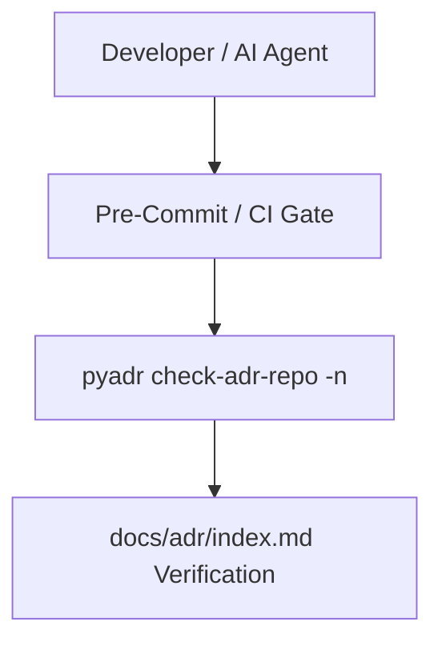

# Architecture Plan: CI PyADR Verification & Health Gate (Spec 001)

## Architecture & Component Mapping

## Requirement Tracing
- **FR-001-01**: Run pyadr validation on every commit.
- **FR-001-02**: Block PR merges on ADR structural failures.
- **FR-001-03**: Enforce index sync via `pyadr toc`.
