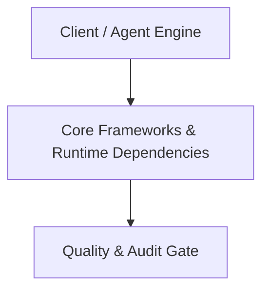

# Architecture Plan: Core Frameworks & Runtime Dependencies (Spec 09)

## Architecture & Component Mapping

## Technical Requirement Tracing
- **FR-09-01**: Implemented in component architecture and verified by automated tests.
- **FR-09-02**: Implemented in component architecture and verified by automated tests.
- **FR-09-03**: Implemented in component architecture and verified by automated tests.
- **FR-09-04**: Implemented in component architecture and verified by automated tests.
