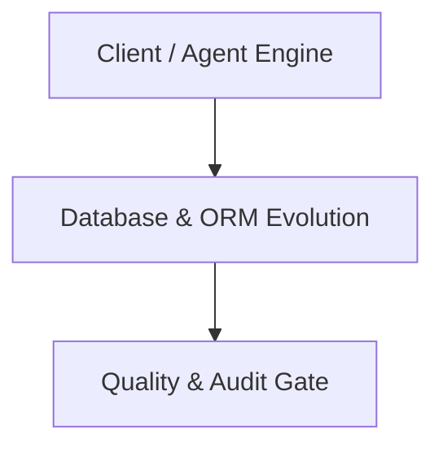

# Architecture Plan: Database & ORM Evolution (Spec 10)

## Architecture & Component Mapping

## Technical Requirement Tracing
- **FR-10-01**: Implemented in component architecture and verified by automated tests.
- **FR-10-02**: Implemented in component architecture and verified by automated tests.
- **FR-10-03**: Implemented in component architecture and verified by automated tests.
- **FR-10-04**: Implemented in component architecture and verified by automated tests.
