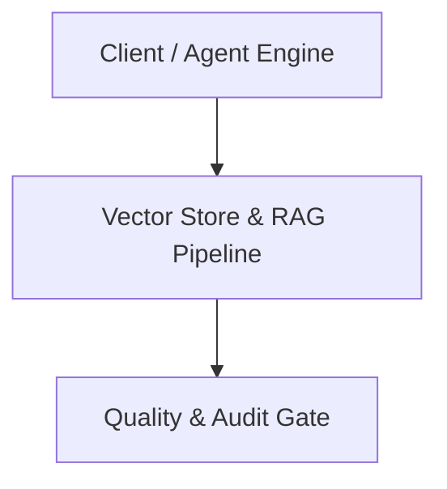

# Architecture Plan: Vector Store & RAG Pipeline (Spec 11)

## Architecture & Component Mapping

## Technical Requirement Tracing
- **FR-11-01**: Implemented in component architecture and verified by automated tests.
- **FR-11-02**: Implemented in component architecture and verified by automated tests.
- **FR-11-03**: Implemented in component architecture and verified by automated tests.
- **FR-11-04**: Implemented in component architecture and verified by automated tests.
