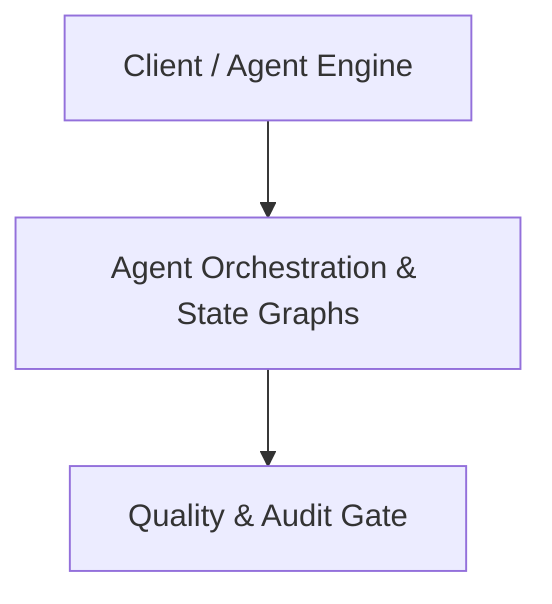

# Architecture Plan: Agent Orchestration & State Graphs (Spec 12)

## Architecture & Component Mapping

## Technical Requirement Tracing
- **FR-12-01**: Implemented in component architecture and verified by automated tests.
- **FR-12-02**: Implemented in component architecture and verified by automated tests.
- **FR-12-03**: Implemented in component architecture and verified by automated tests.
- **FR-12-04**: Implemented in component architecture and verified by automated tests.
