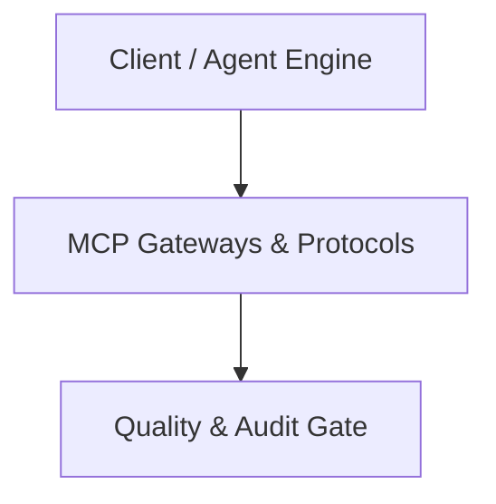

# Architecture Plan: MCP Gateways & Protocols (Spec 13)

## Architecture & Component Mapping

## Technical Requirement Tracing
- **FR-13-01**: Implemented in component architecture and verified by automated tests.
- **FR-13-02**: Implemented in component architecture and verified by automated tests.
- **FR-13-03**: Implemented in component architecture and verified by automated tests.
- **FR-13-04**: Implemented in component architecture and verified by automated tests.
