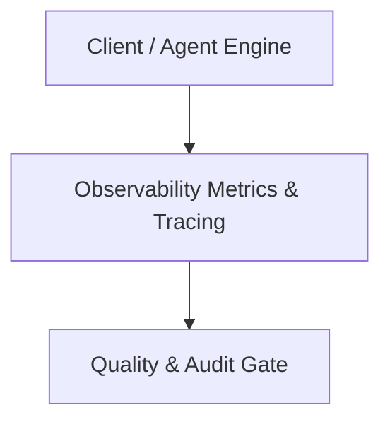

# Architecture Plan: Observability Metrics & Tracing (Spec 14)

## Architecture & Component Mapping

## Technical Requirement Tracing
- **FR-14-01**: Implemented in component architecture and verified by automated tests.
- **FR-14-02**: Implemented in component architecture and verified by automated tests.
- **FR-14-03**: Implemented in component architecture and verified by automated tests.
- **FR-14-04**: Implemented in component architecture and verified by automated tests.
