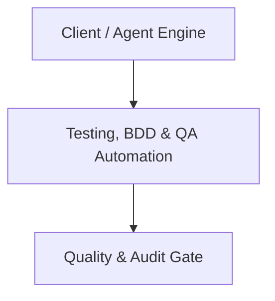

# Architecture Plan: Testing, BDD & QA Automation (Spec 15)

## Architecture & Component Mapping

## Technical Requirement Tracing
- **FR-15-01**: Implemented in component architecture and verified by automated tests.
- **FR-15-02**: Implemented in component architecture and verified by automated tests.
- **FR-15-03**: Implemented in component architecture and verified by automated tests.
- **FR-15-04**: Implemented in component architecture and verified by automated tests.
