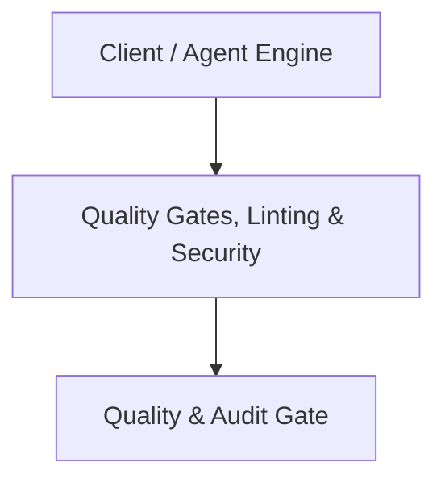

# Architecture Plan: Quality Gates, Linting & Security (Spec 16)

## Architecture & Component Mapping

## Technical Requirement Tracing
- **FR-16-01**: Implemented in component architecture and verified by automated tests.
- **FR-16-02**: Implemented in component architecture and verified by automated tests.
- **FR-16-03**: Implemented in component architecture and verified by automated tests.
- **FR-16-04**: Implemented in component architecture and verified by automated tests.
