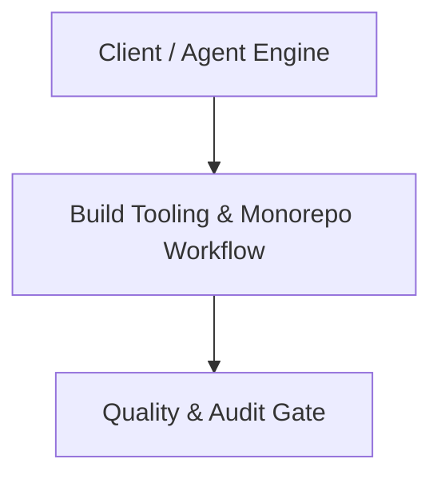

# Architecture Plan: Build Tooling & Monorepo Workflow (Spec 17)

## Architecture & Component Mapping

## Technical Requirement Tracing
- **FR-17-01**: Implemented in component architecture and verified by automated tests.
- **FR-17-02**: Implemented in component architecture and verified by automated tests.
- **FR-17-03**: Implemented in component architecture and verified by automated tests.
- **FR-17-04**: Implemented in component architecture and verified by automated tests.
