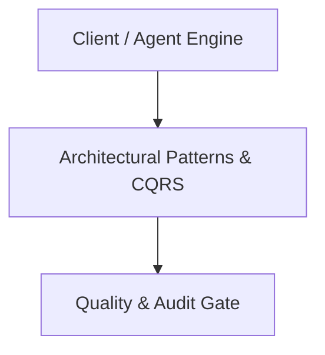

# Architecture Plan: Architectural Patterns & CQRS (Spec 18)

## Architecture & Component Mapping

## Technical Requirement Tracing
- **FR-18-01**: Implemented in component architecture and verified by automated tests.
- **FR-18-02**: Implemented in component architecture and verified by automated tests.
- **FR-18-03**: Implemented in component architecture and verified by automated tests.
- **FR-18-04**: Implemented in component architecture and verified by automated tests.
