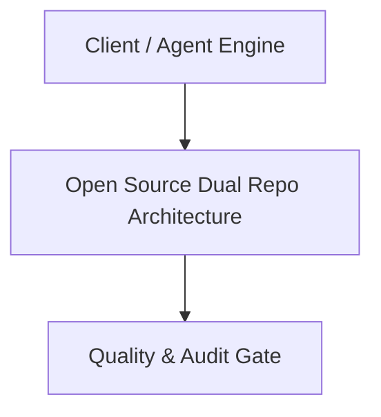

# Architecture Plan: Open Source Dual Repo Architecture (Spec 19)

## Architecture & Component Mapping

## Technical Requirement Tracing
- **FR-19-01**: Implemented in component architecture and verified by automated tests.
- **FR-19-02**: Implemented in component architecture and verified by automated tests.
- **FR-19-03**: Implemented in component architecture and verified by automated tests.
- **FR-19-04**: Implemented in component architecture and verified by automated tests.
