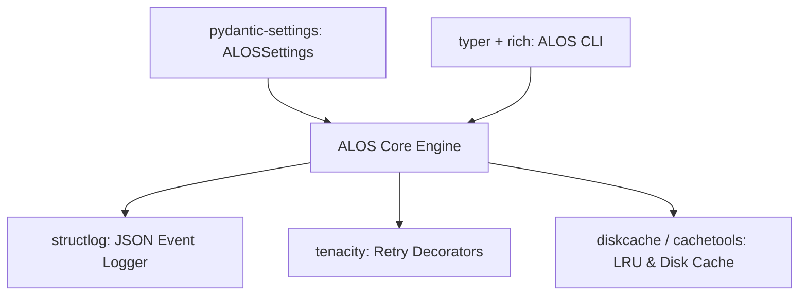

# Architecture Plan: Core Frameworks & Runtime Dependencies (Spec 09)

## Architecture & Component Mapping

## Technical Decisions
- Use `pydantic-settings` to replace custom parsing in `alos/core/config.py`.
- Use `structlog` to standardize logging across `alos/logs/`.
- Use `tenacity` for retries on HTTP and database connections.
