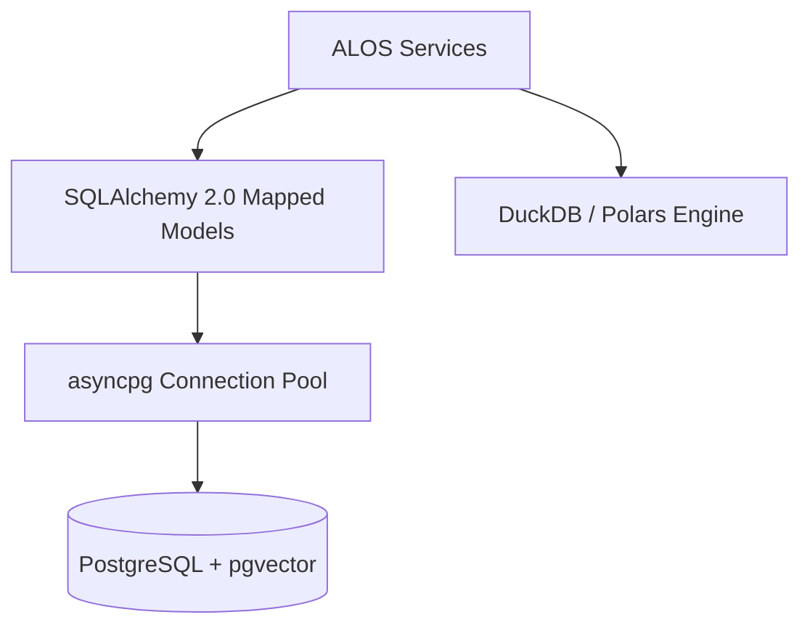

# Architecture Plan: Database & ORM Evolution (Spec 10)

- Migrate `alos/db/models.py` to `Mapped[T]` syntax.
- Add `pgvector` HNSW indexes for embedding search.
- Configure `asyncpg` engine connection pools.
