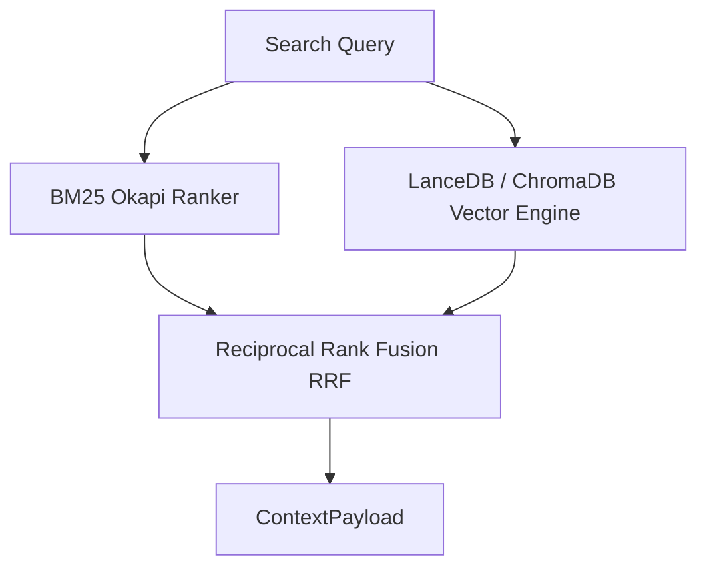

# Architecture Plan: Vector Store & RAG Pipeline (Spec 11)

- Combine `rank_bm25` lexical scores with `lancedb` dense vector scores via RRF.
- Chunk markdown docs using `langchain-text-splitters.MarkdownHeaderTextSplitter`.
