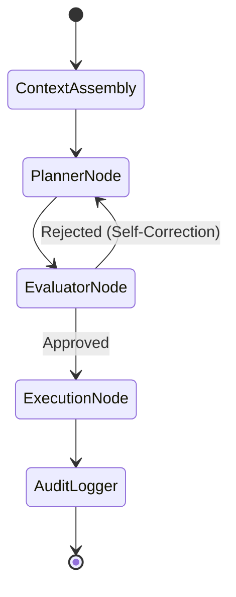

# Architecture Plan: Agent Orchestration & State Graphs (Spec 12)

- Refactor `alos/core/graph.py` to encapsulate a `langgraph.graph.StateGraph`.
- Use `instructor` to enforce Pydantic return schemas on LLM completion nodes.
