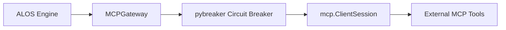

# Architecture Plan: MCP Gateways & Protocols (Spec 13)

```mermaid
graph LR
    Graph[ALOS Engine] --> Gateway[MCPGateway]
    Gateway --> Circuit[pybreaker Circuit Breaker]
    Circuit --> ClientSession[mcp.ClientSession]
    ClientSession --> Server[External MCP Tools]
```

- Wrap external tool API handlers in `pybreaker.CircuitBreaker`.
- Implement `fastmcp` decorator syntax for registering workspace tools.
