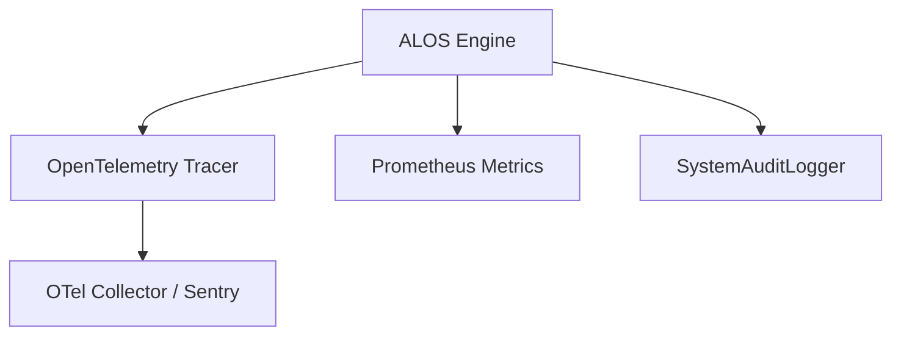

# Architecture Plan: Observability, Metrics & Tracing (Spec 14)

- Instrument `ALOSStateGraph.run()` with OpenTelemetry spans (`tracer.start_as_current_span`).
- Expose Prometheus metrics counter `alos_actions_total{status="approved"}`.
