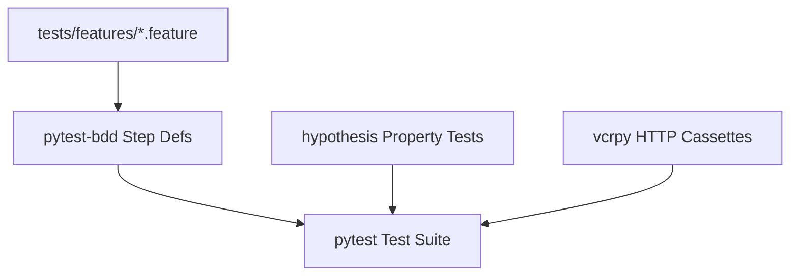

# Architecture Plan: Testing, BDD & QA Automation (Spec 15)

- Add `factory_boy` factory definitions in `tests/factories/`.
- Add `hypothesis` `@given` strategies for testing evaluator rule boundaries.
