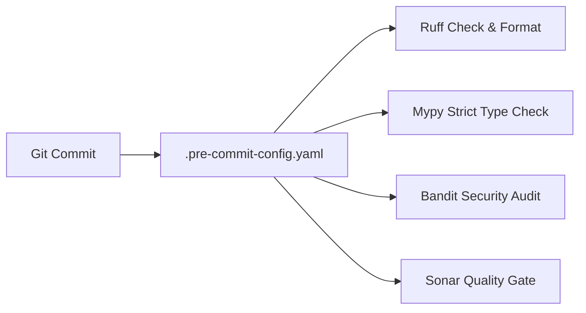

# Architecture Plan: Quality Gates, Linting & Security (Spec 16)

- Configure `bandit` and `pip-audit` in `.pre-commit-config.yaml`.
- Enforce `enable_error_code = ["ignore-without-code"]` in `pyproject.toml`.
