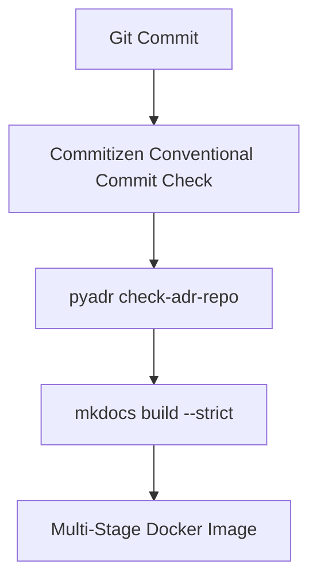

# Architecture Plan: Build Tooling & Monorepo Workflow (Spec 17)

```mermaid
graph TD
    Commit[Git Commit] --> CZ[Commitizen Conventional Commit Check]
    CZ --> ADR[pyadr check-adr-repo]
    ADR --> MkDocs[mkdocs build --strict]
    MkDocs --> Docker[Multi-Stage Docker Image]
```

- Configure `commitizen` in `pyproject.toml`.
- Configure `mkdocs` build pipeline for strict internal link validation.
