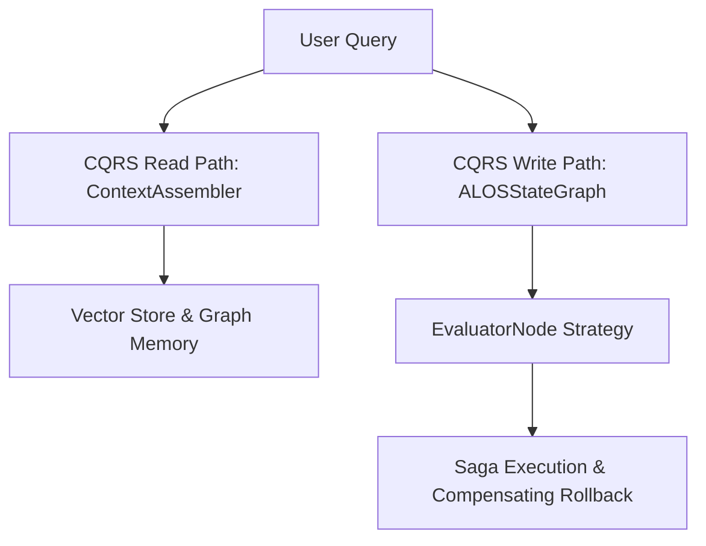

# Architecture Plan: Architectural Design Patterns & CQRS (Spec 18)

- Separate read-heavy memory synthesis (Queries) from write-heavy action evaluation (Commands).
- Implement Saga compensating actions in `MCPGateway` if tool execution fails halfway.
